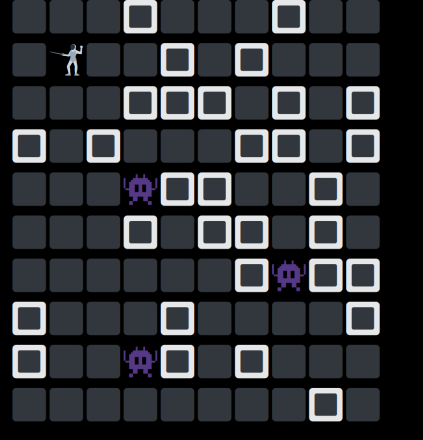

# ReasonHack

ReasonHack is a proof-of-concept minigame written in ReasonML and using
ReasonReact. Hosted at https://reasonhack.netlify.app

Built from Jared Forsyth's app template for his reason react tutorial:
https://github.com/jaredly/a-reason-react-tutorial

## How to Build

We go from ReasonML source to JS, and then bundle with webpack:

`npm start` - Run bucklescript watcher -> From `/src/*.re` put js in /lib
`npm run build` - Run webpack -> Bundle /lib into public/bundle.js
